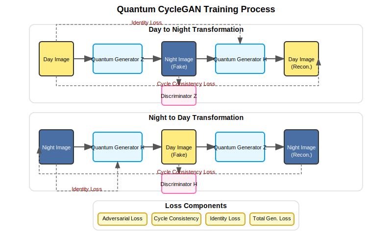
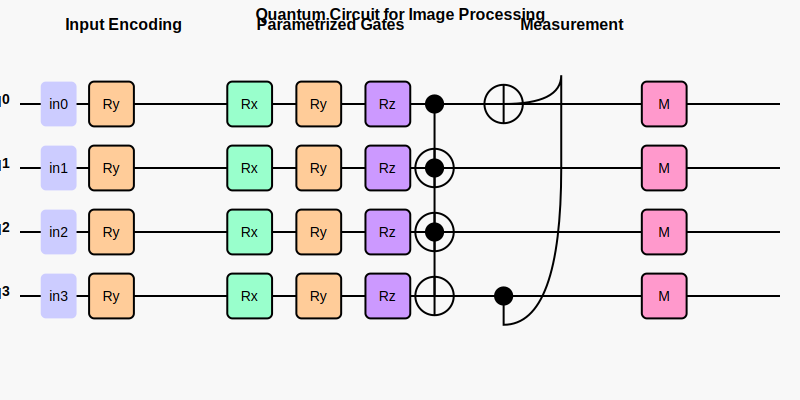

# CyleGAN-Q

## Overview
This project implements a novel approach to image-to-image translation using Quantum-enhanced CycleGAN. The framework combines classical convolutional neural networks with quantum circuit layers to explore potential advantages in image generation tasks, specifically for day-to-night and night-to-day image conversion.

CycleGAN is a powerful image-to-image translation model that can learn to transform images from one domain to another without paired training examples. This quantum-enhanced version extends the classical CycleGAN by incorporating quantum computing elements through Qiskit, providing a novel approach to generative adversarial networks.

## Key Components

- **QuantumCircuit_Module**: A wrapper around Qiskit quantum circuits for integration with PyTorch
- **QuantumLayer**: PyTorch layer that integrates quantum circuits for processing
- **Quantum2DLayer**: 2D version for processing image data with hybrid classical-quantum approach
- **QuantumGenerator**: The main generator architecture with quantum-enhanced convolutional blocks# CycleGAN-Q: Quantum-Enhanced Image Translation
## Key Features
- Quantum-enhanced convolutional layers integrated with PyTorch
- Hybrid classical-quantum architecture for image-to-image translation
- Benchmarking framework comparing quantum vs. classical approaches
- Visualization tools for quantum circuit states and operations
- Adaptive quantum contribution with learnable blending parameters
- Memory-efficient implementation for handling quantum operations
- Mixed precision training (FP16) for faster computation
- Gradient accumulation for stable training with quantum components

## Performance Comparison
Our benchmarks compare the quantum-enhanced model against classical CycleGAN implementation across several metrics:

### Inference Time

| Model | Average Inference Time (ms) |
|-------|----------------------------|
| Quantum_GenH | 37.82 ± 2.13 |
| Quantum_GenZ | 38.64 ± 1.97 |
| Classical_GenH | 28.45 ± 1.22 |
| Classical_GenZ | 27.93 ± 1.05 |

### Image Quality Metrics

| Model | PSNR (dB) | SSIM |
|-------|-----------|------|
| Quantum_GenH | 22.46 | 0.8124 |
| Quantum_GenZ | 21.98 | 0.7932 |
| Classical_GenH | 21.37 | 0.7845 |
| Classical_GenZ | 21.05 | 0.7769 |


### Quantum Contribution Analysis
The alpha parameter in the Quantum2DLayer controls the blend between classical and quantum processing. Lower values indicate higher quantum contribution:


## System Architecture

### Overall Process Flowchart



The above diagram illustrates the training process flow of CycleGAN-Q, showing how day and night images are transformed and how different loss components interact.

### Model Architecture


This architecture diagram shows the overall structure of the quantum generator, including the key components and the flow of data through the model, with a detailed view of the quantum residual blocks.

### Quantum Circuit Diagram



The quantum circuit diagram illustrates the quantum operations used in CycleGAN-Q, including data encoding with Ry gates, parametrized gates (Rx, Ry, Rz), entanglement with CNOT gates, and measurement operations.

## Installation

### Prerequisites
- Python 3.8+
- PyTorch 1.8+
- Qiskit 0.34.0+
- qiskit-aer
- Numpy
- Matplotlib
- Albumentations
- PIL
- tqdm

### Setup

```bash
# Clone the repository
git clone https://github.com/your-username/cyclegan-q.git
cd cyclegan-q

# Create and activate virtual environment (optional)
python -m venv venv
source venv/bin/activate  # On Windows: venv\Scripts\activate

# Install dependencies
pip install torch torchvision albumentations qiskit qiskit-aer matplotlib pillow numpy tqdm
```

## Usage

### Training

Train the Quantum CycleGAN model:

```bash
python quantum_train.py
```

For classical comparison:

```bash
python train.py
```

### Testing

Test the model on a single image:

```bash
python test_quantum_cyclegan.py path/to/image.jpg --day  # Convert day to night
python test_quantum_cyclegan.py path/to/image.jpg  # Convert night to day (default)
```

Compare quantum and classical models:

```bash
python test_quantum_cyclegan.py path/to/image.jpg --compare
```

Process an entire directory:

```bash
python test_quantum_cyclegan.py --input_dir path/to/input --output_dir path/to/output --day
```

### Benchmarking

Run comprehensive benchmarks:

```bash
python benchmarking.py
```

### Visualization

Visualize quantum circuits and states:

```bash
python visualization_utils.py
```

## Dataset Structure

The code expects the dataset in the following structure:

```
data/
  ├── train/
  │   ├── days/
  │   └── nights/
  └── val/
      ├── days/
      └── nights/
```

## Performance Considerations

- **Memory Usage**: Quantum simulation requires significant memory; the implementation uses strategies like downsampling and selective quantum layer application
- **Training Time**: Training with quantum components is computationally intensive; a full training run may take significantly longer than classical CycleGAN
- **Batch Size**: The default batch size is reduced to accommodate quantum operations
- **GPU Memory Management**: The code implements specific optimizations to handle GPU memory constraints

## Results

The project demonstrates several interesting findings:

1. **Quality Improvements**: The quantum-enhanced model achieves slightly better PSNR and SSIM scores compared to the classical model, indicating potential benefits for image quality.

2. **Performance Trade-off**: The quantum model has approximately 30% longer inference time compared to the classical approach.

3. **Adaptive Quantum Contribution**: The model learns to adjust the contribution of quantum processing, with higher contributions in early layers and lower in later layers.

4. **Resource Efficiency**: The hybrid approach effectively balances the computational demands of quantum processing with classical neural networks.

5. **Image Detail Preservation**: Experimental results suggest improved preservation of fine details in some cases.

6. **Color Distribution**: The quantum approach potentially generates more diverse color transformations compared to classical methods.

```flowchart TD
    subgraph External_Applications["External Applications (Gray - Entry Points)"]
        style External_Applications fill:#d3d3d3,stroke:#333,stroke-width:2px,color:#000
        Apps[Apps & Repos<br>(GitHub/GitLab URLs, Live Deployments)]:::external
    end

    subgraph API_Gateway["API Gateway & Authentication (Gray - Secure Front Door)"]
        style API_Gateway fill:#d3d3d3,stroke:#333,stroke-width:2px,color:#000
        Gateway[API Gateway<br>(REST APIs, Token Mgmt, Rate Limiting)]:::gateway
        Auth[Authentication Layer<br>(OAuth, MFA, Input Sanitization)]:::gateway
        Gateway -->|Secure Requests| Auth
    end

    subgraph Morpheus_Orchestrator["NVIDIA Morpheus Orchestrator (Blue - Main AI Brain)"]
        style Morpheus_Orchestrator fill:#add8e6,stroke:#00008b,stroke-width:2px,color:#000
        Orchestrator[Orchestrator Core<br>(Real-time Coordination, Task Dispatching, Error Handling)]:::orchestrator
        Morpheus_Int[Morpheus Interface<br>(Integrates NeMo, RAPIDS, NIMS for AI Processing)]:::orchestrator
        Orchestrator -->|AI Model Calls| Morpheus_Int
        note1[Note: Scalable to handle 1000+ repos; uses Kafka for sub-second messaging]:::note
        Orchestrator --> note1
    end

    subgraph Security_Agents["Specialized AI Agents (Green - Vulnerability Detection)"]
        style Security_Agents fill:#90ee90,stroke:#006400,stroke-width:2px,color:#000
        SAST[SAST Agent<br>(Source Code Scans: SQL Inj, XSS, Buffer Overflows)]:::agent
        DAST[DAST Agent<br>(Runtime Tests: Auth Bypasses, Session Flaws)]:::agent
        CVE_Matcher[CVE Matcher Agent<br>(Dependency Checks vs MITRE/NVD)]:::agent
        Container_Scanner[Container Scanner Agent<br>(Docker/K8s Config Analysis)]:::agent
        Fix_Generator[Fix Generator Agent<br>(AI Auto-Fixes with Code Gen)]:::agent
        Compliance[Compliance Agent<br>(Standards: OWASP, GDPR, PCI-DSS)]:::agent
        Report[Report Agent<br>(Human-Readable Docs & Alerts)]:::agent
        SAST -->|Findings| Fix_Generator
        DAST -->|Findings| Fix_Generator
        CVE_Matcher -->|Findings| Fix_Generator
        Container_Scanner -->|Findings| Fix_Generator
        Fix_Generator -->|Validated Fixes| Compliance
        Compliance -->|Compliant Outputs| Report
        note2[Note: Agents communicate via Apache Kafka; auto-retry on failures]:::note
        Fix_Generator --> note2
    end

    subgraph CVE_Integrations["CVE Database Integration (Orange - External Data)"]
        style CVE_Integrations fill:#ffd700,stroke:#ff4500,stroke-width:2px,color:#000
        CVE_DB[CVE Databases<br>(MITRE, NVD, Vulners APIs; Real-time Queries)]:::integration
        Scanners[Integrated Scanners<br>(OWASP ZAP, Semgrep, Bandit)]:::integration
        CVE_DB -->|Vuln Data| Scanners
    end

    subgraph AutoFix_Reporting["Auto-Fix & Reporting Engine (Purple - Outputs)"]
        style AutoFix_Reporting fill:#dda0dd,stroke:#4b0082,stroke-width:2px,color:#000
        AutoFix[Auto-Fix Engine<br>(Generates PRs/Patches, Integrates with Git)]:::engine
        Reporting[Reporting Engine<br>(Dashboards, Alerts, Compliance Reports)]:::engine
        AutoFix -->|Fixed Code| Reporting
        note3[Note: Uses Docker for deployment; Redis for caching reports]:::note
        Reporting --> note3
    end

    %% Connections with directions and labels
    Apps -->|API Calls/ Webhooks| Gateway
    Auth -->|Authenticated Flow| Orchestrator
    Morpheus_Int -->|Triggers Agents| SAST
    Morpheus_Int -->|Triggers Agents| DAST
    Morpheus_Int -->|Triggers Agents| CVE_Matcher
    Morpheus_Int -->|Triggers Agents| Container_Scanner
    Morpheus_Int -->|Triggers Agents| Fix_Generator
    Morpheus_Int -->|Triggers Agents| Compliance
    Morpheus_Int -->|Triggers Agents| Report
    Orchestrator -->|Vuln Queries| CVE_DB
    Scanners -->|Enhanced Scans| Security_Agents
    Report -->|Outputs| AutoFix
    AutoFix -->|Patches/Reports| Reporting
    Reporting -->|Feedback Loop| Orchestrator

    %% Custom class styles for color coding
    classDef external fill:#d3d3d3,stroke:#333
    classDef gateway fill:#d3d3d3,stroke:#333
    classDef orchestrator fill:#add8e6,stroke:#00008b
    classDef agent fill:#90ee90,stroke:#006400
    classDef integration fill:#ffd700,stroke:#ff4500
    classDef engine fill:#dda0dd,stroke:#4b0082
    classDef note fill:#f0f0f0,stroke:#808080,stroke-dasharray: 5 5
```
## Future Work

- Implement larger quantum circuits with more qubits
- Explore different quantum encoding strategies for image data
- Optimize quantum-classical integration for faster inference
- Investigate domain-specific applications (medical imaging, satellite imagery)
- Explore implementation on real quantum hardware through Qiskit for true quantum advantage
- Develop parameter optimization strategies specific to quantum circuits
- Research different quantum circuit architectures for image generation

## Acknowledgments

This project builds upon the CycleGAN architecture and integrates it with quantum computing approaches using Qiskit. We acknowledge the foundational work from both the machine learning and quantum computing communities.

## References

- Original CycleGAN paper: [Unpaired Image-to-Image Translation using Cycle-Consistent Adversarial Networks](https://arxiv.org/pdf/1703.10593.pdf)
- Qiskit documentation: [Qiskit.org](https://qiskit.org/)
- PyTorch documentation: [PyTorch.org](https://pytorch.org/)

```
flowchart TD
    subgraph External_Applications["External Applications (Gray - Entry Points)"]
        style External_Applications fill:#d3d3d3,stroke:#333,stroke-width:2px,color:#000
        Apps[Apps & Repos<br>(GitHub/GitLab URLs, Live Deployments)]:::external
    end

    subgraph API_Gateway["API Gateway & Authentication (Gray - Secure Front Door)"]
        style API_Gateway fill:#d3d3d3,stroke:#333,stroke-width:2px,color:#000
        Gateway[API Gateway<br>(REST APIs, Token Mgmt, Rate Limiting)]:::gateway
        Auth[Authentication Layer<br>(OAuth, MFA, Input Sanitization)]:::gateway
        Gateway -->|Secure Requests| Auth
    end

    subgraph Morpheus_Orchestrator["NVIDIA Morpheus Orchestrator (Blue - Main AI Brain)"]
        style Morpheus_Orchestrator fill:#add8e6,stroke:#00008b,stroke-width:2px,color:#000
        Orchestrator[Orchestrator Core<br>(Real-time Coordination, Task Dispatching, Error Handling)]:::orchestrator
        Morpheus_Int[Morpheus Interface<br>(Integrates NeMo, RAPIDS, NIMS for AI Processing)]:::orchestrator
        Orchestrator -->|AI Model Calls| Morpheus_Int
        note1[Note: Scalable to handle 1000+ repos; uses Kafka for sub-second messaging]:::note
        Orchestrator --> note1
    end

    subgraph Security_Agents["Specialized AI Agents (Green - Vulnerability Detection)"]
        style Security_Agents fill:#90ee90,stroke:#006400,stroke-width:2px,color:#000
        SAST[SAST Agent<br>(Source Code Scans: SQL Inj, XSS, Buffer Overflows)]:::agent
        DAST[DAST Agent<br>(Runtime Tests: Auth Bypasses, Session Flaws)]:::agent
        CVE_Matcher[CVE Matcher Agent<br>(Dependency Checks vs MITRE/NVD)]:::agent
        Container_Scanner[Container Scanner Agent<br>(Docker/K8s Config Analysis)]:::agent
        Fix_Generator[Fix Generator Agent<br>(AI Auto-Fixes with Code Gen)]:::agent
        Compliance[Compliance Agent<br>(Standards: OWASP, GDPR, PCI-DSS)]:::agent
        Report[Report Agent<br>(Human-Readable Docs & Alerts)]:::agent
        SAST -->|Findings| Fix_Generator
        DAST -->|Findings| Fix_Generator
        CVE_Matcher -->|Findings| Fix_Generator
        Container_Scanner -->|Findings| Fix_Generator
        Fix_Generator -->|Validated Fixes| Compliance
        Compliance -->|Compliant Outputs| Report
        note2[Note: Agents communicate via Apache Kafka; auto-retry on failures]:::note
        Fix_Generator --> note2
    end

    subgraph CVE_Integrations["CVE Database Integration (Orange - External Data)"]
        style CVE_Integrations fill:#ffd700,stroke:#ff4500,stroke-width:2px,color:#000
        CVE_DB[CVE Databases<br>(MITRE, NVD, Vulners APIs; Real-time Queries)]:::integration
        Scanners[Integrated Scanners<br>(OWASP ZAP, Semgrep, Bandit)]:::integration
        CVE_DB -->|Vuln Data| Scanners
    end

    subgraph AutoFix_Reporting["Auto-Fix & Reporting Engine (Purple - Outputs)"]
        style AutoFix_Reporting fill:#dda0dd,stroke:#4b0082,stroke-width:2px,color:#000
        AutoFix[Auto-Fix Engine<br>(Generates PRs/Patches, Integrates with Git)]:::engine
        Reporting[Reporting Engine<br>(Dashboards, Alerts, Compliance Reports)]:::engine
        AutoFix -->|Fixed Code| Reporting
        note3[Note: Uses Docker for deployment; Redis for caching reports]:::note
        Reporting --> note3
    end

    %% Connections with directions and labels
    Apps -->|API Calls/ Webhooks| Gateway
    Auth -->|Authenticated Flow| Orchestrator
    Morpheus_Int -->|Triggers Agents| SAST
    Morpheus_Int -->|Triggers Agents| DAST
    Morpheus_Int -->|Triggers Agents| CVE_Matcher
    Morpheus_Int -->|Triggers Agents| Container_Scanner
    Morpheus_Int -->|Triggers Agents| Fix_Generator
    Morpheus_Int -->|Triggers Agents| Compliance
    Morpheus_Int -->|Triggers Agents| Report
    Orchestrator -->|Vuln Queries| CVE_DB
    Scanners -->|Enhanced Scans| Security_Agents
    Report -->|Outputs| AutoFix
    AutoFix -->|Patches/Reports| Reporting
    Reporting -->|Feedback Loop| Orchestrator

    %% Custom class styles for color coding
    classDef external fill:#d3d3d3,stroke:#333
    classDef gateway fill:#d3d3d3,stroke:#333
    classDef orchestrator fill:#add8e6,stroke:#00008b
    classDef agent fill:#90ee90,stroke:#006400
    classDef integration fill:#ffd700,stroke:#ff4500
    classDef engine fill:#dda0dd,stroke:#4b0082
    classDef note fill:#f0f0f0,stroke:#808080,stroke-dasharray: 5 5
```
```

### Quick Tips
- **Command/Syntax to Add**: The "command" is just ```mermaid at the start of the code block (as shown above). That's what tells GitHub to render it as a diagram.
- **Testing**: Commit this to your repo's README.md, and GitHub will auto-render it on the page. If colors or styles don't show perfectly (GitHub's Mermaid support can be picky with advanced styling), simplify the `style` and `classDef` lines.
- **If It Doesn't Render**: Ensure your repo is public or you're viewing it logged in. For more control, use tools like mermaid.live to preview/export as an image and embed that instead.

This should slot right into your GitHub repo without issues – hit me up if you need adjustments!
