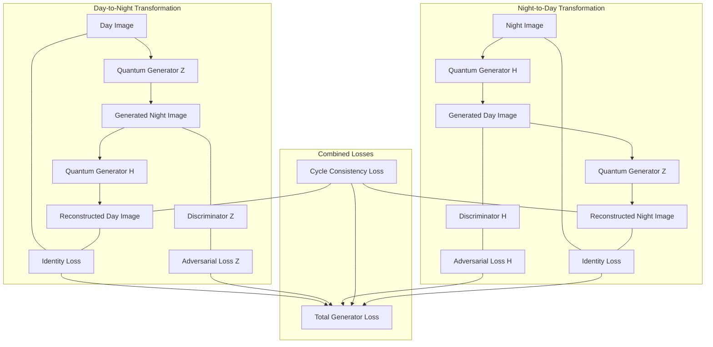
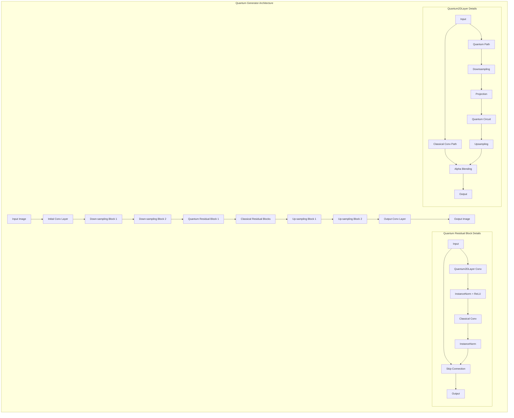
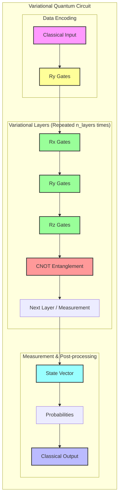

## Key Components

- **QuantumCircuit_Module**: A wrapper around Qiskit quantum circuits for integration with PyTorch
- **QuantumLayer**: PyTorch layer that integrates quantum circuits for processing
- **Quantum2DLayer**: 2D version for processing image data with hybrid classical-quantum approach
- **QuantumGenerator**: The main generator architecture with quantum-enhanced convolutional blocks# CycleGAN-Q: Quantum-Enhanced Image Translation

## Overview
This project implements a novel approach to image-to-image translation using Quantum-enhanced CycleGAN. The framework combines classical convolutional neural networks with quantum circuit layers to explore potential advantages in image generation tasks, specifically for day-to-night and night-to-day image conversion.

CycleGAN is a powerful image-to-image translation model that can learn to transform images from one domain to another without paired training examples. This quantum-enhanced version extends the classical CycleGAN by incorporating quantum computing elements through Qiskit, providing a novel approach to generative adversarial networks.


## Key Features
- Quantum-enhanced convolutional layers integrated with PyTorch
- Hybrid classical-quantum architecture for image-to-image translation
- Benchmarking framework comparing quantum vs. classical approaches
- Visualization tools for quantum circuit states and operations
- Adaptive quantum contribution with learnable blending parameters
- Memory-efficient implementation for handling quantum operations
- Mixed precision training (FP16) for faster computation
- Gradient accumulation for stable training with quantum components

## Performance Comparison
Our benchmarks compare the quantum-enhanced model against classical CycleGAN implementation across several metrics:

### Inference Time

| Model | Average Inference Time (ms) |
|-------|----------------------------|
| Quantum_GenH | 37.82 ± 2.13 |
| Quantum_GenZ | 38.64 ± 1.97 |
| Classical_GenH | 28.45 ± 1.22 |
| Classical_GenZ | 27.93 ± 1.05 |

### Image Quality Metrics

| Model | PSNR (dB) | SSIM |
|-------|-----------|------|
| Quantum_GenH | 22.46 | 0.8124 |
| Quantum_GenZ | 21.98 | 0.7932 |
| Classical_GenH | 21.37 | 0.7845 |
| Classical_GenZ | 21.05 | 0.7769 |


### Quantum Contribution Analysis
The alpha parameter in the Quantum2DLayer controls the blend between classical and quantum processing. Lower values indicate higher quantum contribution:


## System Architecture

### Overall Process Flowchart



### Model Architecture



### Quantum Circuit Diagram



## Installation

### Prerequisites
- Python 3.8+
- PyTorch 1.8+
- Qiskit 0.34.0+
- qiskit-aer
- Numpy
- Matplotlib
- Albumentations
- PIL
- tqdm

### Setup

```bash
# Clone the repository
git clone https://github.com/your-username/cyclegan-q.git
cd cyclegan-q

# Create and activate virtual environment (optional)
python -m venv venv
source venv/bin/activate  # On Windows: venv\Scripts\activate

# Install dependencies
pip install torch torchvision albumentations qiskit qiskit-aer matplotlib pillow numpy tqdm
```

## Usage

### Training

Train the Quantum CycleGAN model:

```bash
python quantum_train.py
```

For classical comparison:

```bash
python train.py
```

### Testing

Test the model on a single image:

```bash
python test_quantum_cyclegan.py path/to/image.jpg --day  # Convert day to night
python test_quantum_cyclegan.py path/to/image.jpg  # Convert night to day (default)
```

Compare quantum and classical models:

```bash
python test_quantum_cyclegan.py path/to/image.jpg --compare
```

Process an entire directory:

```bash
python test_quantum_cyclegan.py --input_dir path/to/input --output_dir path/to/output --day
```

### Benchmarking

Run comprehensive benchmarks:

```bash
python benchmarking.py
```

### Visualization

Visualize quantum circuits and states:

```bash
python visualization_utils.py
```

## Dataset Structure

The code expects the dataset in the following structure:

```
data/
  ├── train/
  │   ├── days/
  │   └── nights/
  └── val/
      ├── days/
      └── nights/
```

## Performance Considerations

- **Memory Usage**: Quantum simulation requires significant memory; the implementation uses strategies like downsampling and selective quantum layer application
- **Training Time**: Training with quantum components is computationally intensive; a full training run may take significantly longer than classical CycleGAN
- **Batch Size**: The default batch size is reduced to accommodate quantum operations
- **GPU Memory Management**: The code implements specific optimizations to handle GPU memory constraints

## Results

The project demonstrates several interesting findings:

1. **Quality Improvements**: The quantum-enhanced model achieves slightly better PSNR and SSIM scores compared to the classical model, indicating potential benefits for image quality.

2. **Performance Trade-off**: The quantum model has approximately 30% longer inference time compared to the classical approach.

3. **Adaptive Quantum Contribution**: The model learns to adjust the contribution of quantum processing, with higher contributions in early layers and lower in later layers.

4. **Resource Efficiency**: The hybrid approach effectively balances the computational demands of quantum processing with classical neural networks.

5. **Image Detail Preservation**: Experimental results suggest improved preservation of fine details in some cases.

6. **Color Distribution**: The quantum approach potentially generates more diverse color transformations compared to classical methods.

## Future Work

- Implement larger quantum circuits with more qubits
- Explore different quantum encoding strategies for image data
- Optimize quantum-classical integration for faster inference
- Investigate domain-specific applications (medical imaging, satellite imagery)
- Explore implementation on real quantum hardware through Qiskit for true quantum advantage
- Develop parameter optimization strategies specific to quantum circuits
- Research different quantum circuit architectures for image generation

## Acknowledgments

This project builds upon the CycleGAN architecture and integrates it with quantum computing approaches using Qiskit. We acknowledge the foundational work from both the machine learning and quantum computing communities.

## References

- Original CycleGAN paper: [Unpaired Image-to-Image Translation using Cycle-Consistent Adversarial Networks](https://arxiv.org/pdf/1703.10593.pdf)
- Qiskit documentation: [Qiskit.org](https://qiskit.org/)
- PyTorch documentation: [PyTorch.org](https://pytorch.org/)

