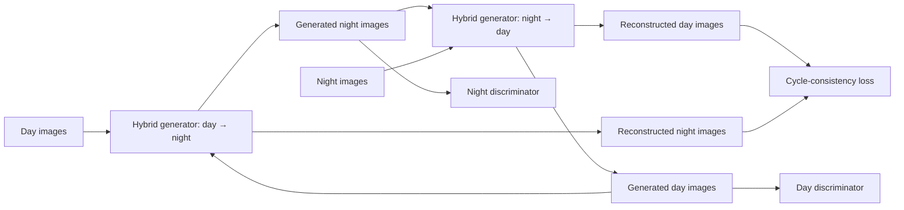
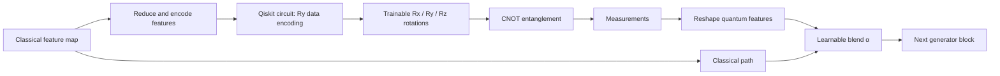
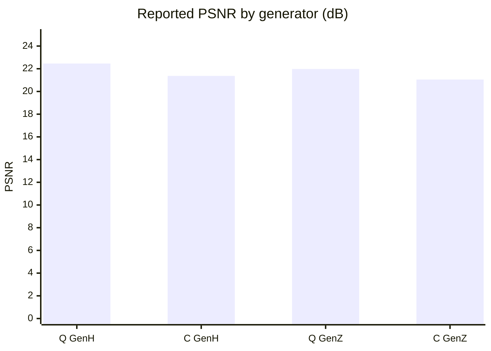

# CycleGAN-Q

### Hybrid quantum–classical image translation for day and night scenes

CycleGAN-Q explores whether simulated quantum circuits can add useful feature
transformations to an unpaired image-to-image translation model. It combines
PyTorch generators and discriminators with Qiskit-based quantum layers, and
compares the resulting model with a classical CycleGAN baseline.

**Project status:** Research prototype. The benchmark figures below are taken
from the project draft; hardware, dataset split, repetitions, and statistical
test details were not provided. They should be treated as reported results,
not evidence of a general quantum advantage.

[Overview](#overview) · [Architecture](#architecture) ·
[Getting started](#getting-started) · [Benchmarks](#reported-benchmarks) ·
[Limitations](#limitations)

---

## Overview

Classical CycleGAN learns mappings between two image domains without requiring
matched image pairs. In this project, the domains are **day** and **night**.
CycleGAN-Q adds quantum-circuit processing inside the generator and uses a
learnable blend to combine quantum and classical features.

| Goal | Approach |
| --- | --- |
| Translate day ↔ night | Two generators learn opposite directions |
| Keep scene structure | Cycle-consistency and identity losses |
| Make outputs look plausible | A discriminator for each image domain |
| Study quantum contribution | Parameterized circuit layers blended with classical features |
| Compare fairly | Benchmark quantum generators against classical counterparts |

The term *quantum* here refers to simulated quantum circuits in the supplied
implementation. Running a Qiskit simulation does not, by itself, establish a
speedup or an advantage over classical models.

## Architecture

### Image translation and training signals


```mermaid
flowchart LR
    Day["Day images"] --> GDN["Hybrid generator: day → night"]
    GDN --> NightOut["Generated night images"]
    NightOut --> GND["Hybrid generator: night → day"]
    GND --> DayRebuilt["Reconstructed day images"]

    Night["Night images"] --> GND
    GND --> DayOut["Generated day images"]
    DayOut --> GDN
    GDN --> NightRebuilt["Reconstructed night images"]

    NightOut --> DN["Night discriminator"]
    DayOut --> DD["Day discriminator"]
    DayRebuilt --> Cycle["Cycle-consistency loss"]
    NightRebuilt --> Cycle
```

The generators pursue target-domain realism while the cycle loss discourages
changes that prevent reconstruction of the original scene. Identity loss helps
limit unnecessary edits. These objectives guide the model; they do not
guarantee that every object or safety-critical detail is preserved.

### Inside a quantum-enhanced feature block


```mermaid
flowchart LR
    A["Classical feature map"] --> B["Reduce and encode features"]
    B --> C["Qiskit circuit: Ry data encoding"]
    C --> D["Trainable Rx / Ry / Rz rotations"]
    D --> E["CNOT entanglement"]
    E --> F["Measurements"]
    F --> G["Reshape quantum features"]
    A --> H["Classical path"]
    G --> I["Learnable blend α"]
    H --> I
    I --> J["Next generator block"]
```

The project draft describes four implementation pieces:

| Component | Purpose |
| --- | --- |
| `QuantumCircuit_Module` | Wraps a Qiskit circuit for model integration |
| `QuantumLayer` | Exposes quantum processing inside a PyTorch layer |
| `Quantum2DLayer` | Applies the hybrid approach to image feature maps |
| `QuantumGenerator` | Builds the image generator from classical and quantum blocks |

The `Quantum2DLayer` uses a learnable `α` parameter to blend paths. In the
project's stated convention, **lower `α` means more quantum contribution**.
Track this value during training to see what the model actually learns.

## Getting started

### Dependencies

- Python and a compatible PyTorch/torchvision installation
- Qiskit and `qiskit-aer`
- Albumentations, NumPy, Matplotlib, Pillow, and tqdm

Install versions compatible with the code and your CPU/CUDA environment. The
original draft lists minimum versions, but it does not provide a tested lockfile
or environment matrix.

```bash
python -m venv .venv
```

Activate `.venv` using the command for your shell, then install dependencies:

```bash
# macOS/Linux
source .venv/bin/activate

# Windows PowerShell: .\.venv\Scripts\Activate.ps1
python -m pip install torch torchvision qiskit qiskit-aer albumentations numpy matplotlib pillow tqdm
```

Run the following commands from the repository root.

### Dataset layout

Day and night images live in separate folders; aligned pairs are not required.

```text
data/
├── train/
│   ├── days/
│   └── nights/
└── val/
    ├── days/
    └── nights/
```

### Train and compare

```bash
python quantum_train.py
python train.py
```

The first command trains CycleGAN-Q; the second trains the classical baseline.
The implementation describes memory controls including selective quantum
processing, gradient accumulation, mixed precision, and smaller batches.
Quantum simulation can still increase memory use and training time.

### Run inference

```bash
# Day to night
python test_quantum_cyclegan.py path/to/image.jpg --day

# Night to day (documented default)
python test_quantum_cyclegan.py path/to/image.jpg

# Side-by-side quantum/classical comparison
python test_quantum_cyclegan.py path/to/image.jpg --compare

# Process a directory
python test_quantum_cyclegan.py --input_dir path/to/input --output_dir path/to/output --day
```

### Benchmark and inspect circuits

```bash
python benchmarking.py
python visualization_utils.py
```

The scripts and flags above come from the supplied project description. Check
their `--help` output and configuration in the actual repository if they differ
from this draft.

## Reported benchmarks

The supplied comparison reports the following averages. `GenH` and `GenZ` are
kept as model names because the draft does not define their direction labels.

| Generator | Quantum inference | Classical inference | Difference |
| --- | ---: | ---: | ---: |
| `GenH` | 37.82 ± 2.13 ms | 28.45 ± 1.22 ms | +9.37 ms, about 33% slower |
| `GenZ` | 38.64 ± 1.97 ms | 27.93 ± 1.05 ms | +10.71 ms, about 38% slower |

| Generator | Quantum PSNR | Classical PSNR | Quantum SSIM | Classical SSIM |
| --- | ---: | ---: | ---: | ---: |
| `GenH` | 22.46 dB | 21.37 dB | 0.8124 | 0.7845 |
| `GenZ` | 21.98 dB | 21.05 dB | 0.7932 | 0.7769 |


```mermaid
xychart-beta
    title "Reported PSNR by generator (dB)"
    x-axis ["Q GenH", "C GenH", "Q GenZ", "C GenZ"]
    y-axis "PSNR" 0 --> 25
    bar [22.46, 21.37, 21.98, 21.05]
```

In the reported table, the quantum models have higher PSNR and SSIM but take
longer to run. The draft does not state the evaluation dataset, hardware,
number of benchmark runs, or whether differences are statistically reliable.
Qualitative observations about detail preservation, color diversity, and layer
contribution still need supporting examples and measurements.

## Limitations

- **Simulator cost:** Quantum circuit simulation can be expensive in memory
  and time as the number of qubits or circuit depth grows.
- **No established quantum advantage:** Better numbers in one reported table
  do not show that quantum processing caused the gain or that it will generalize.
- **Scene fidelity needs separate evaluation:** Cycle consistency can preserve
  broad structure while still changing small, important objects.
- **Reproducibility needs more detail:** Publish dataset splits, seeds, image
  resolution, hardware, checkpoints, baseline tuning, and benchmark scripts.

## Next experiments

1. Compare multiple seeds and matched training budgets with the classical
   baseline.
2. Ablate the quantum layer, circuit depth, encoding, and learnable blend.
3. Report visual examples alongside PSNR, SSIM, latency, and memory use.
4. Test larger circuits only when the simulator cost remains practical.
5. Explore real quantum hardware as a separate experiment with hardware noise
   and data-transfer costs included in the analysis.

## References

- Zhu, Park, Isola, and Efros, [*Unpaired Image-to-Image Translation using
  Cycle-Consistent Adversarial Networks*](https://arxiv.org/abs/1703.10593).
- [Qiskit documentation](https://qiskit.org/).
- [PyTorch documentation](https://pytorch.org/).
